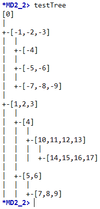

# Haskell
Small programs in programming language Haskell. Haskell is a standardized, general-purpose, purely functional programming language with non-strict semantics and strong static typing. It is named after logician Haskell Curry.
http://www.haskell.org/
http://www.haskell.org/platform/

For code editing any text editor can be used. 

## Getting Started

These instructions will get you a copy of the project up and running on your local machine for development and testing purposes. See deployment for notes on how to deploy the project on a live system.

### Installing

Minimal installer provide centrally the GHC compiler and the Cabal and Stack tools for installing packages.
For running this project, core installer is enough.
https://www.haskell.org/downloads#minimal

### Running the tests on Dictionary.hs

Open GHCi

Get help
```
:?
```
Load module Dictionary
```
:load C:\...\Dictionary.hs
```
Print test results
```
aa1
aa2
bb1
bb2
kk1
kk2
```

## Running the tests on Tree.hs

Open GHCi

Get help
```
:?
```
Load module Tree
```
:load C:\...\Tree.hs
```
Print test results
```
testTree
ff_a testTree
ff_b testTree
ff_c testTree
```


